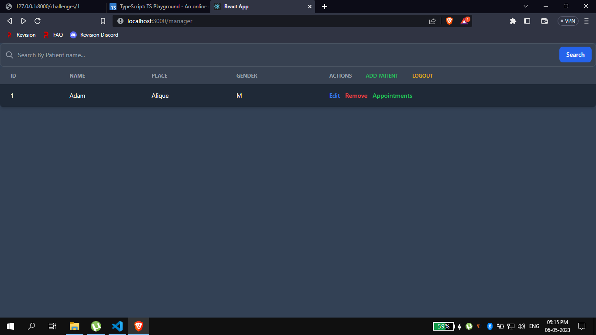

# Patient Management System

## Stack
*Mongodb\
*Express\
*React\
*Nodejs
## Installation 
cd front-end\
npm install\
npm start\

cd .. \
cd server\
npm install\
Which install all the dependencies for Backend

* The image of patients list is below

